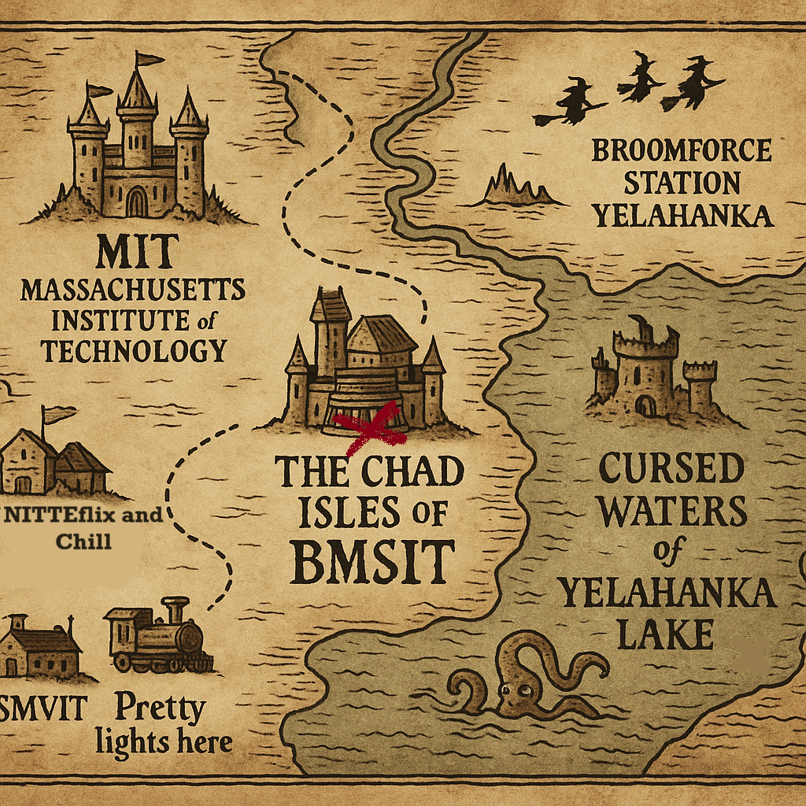
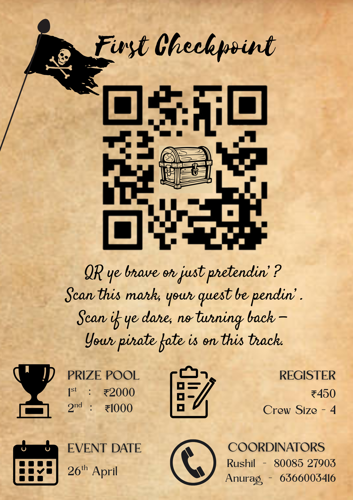
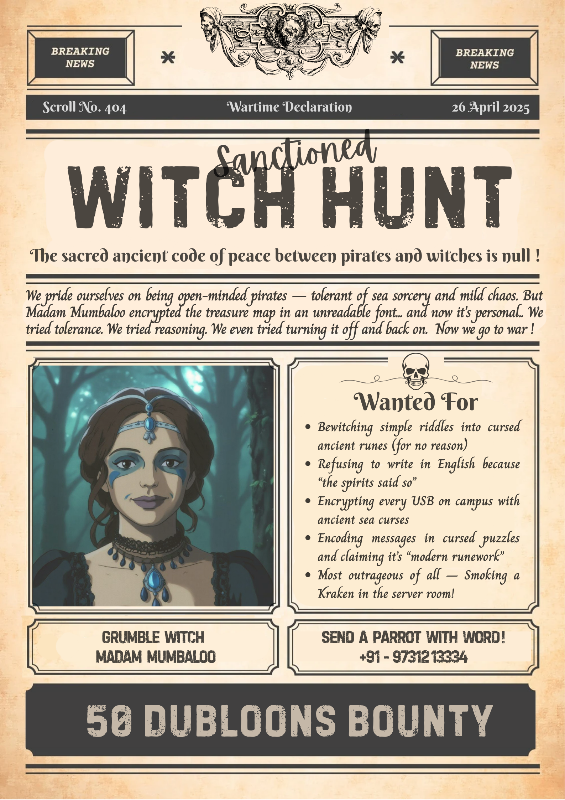
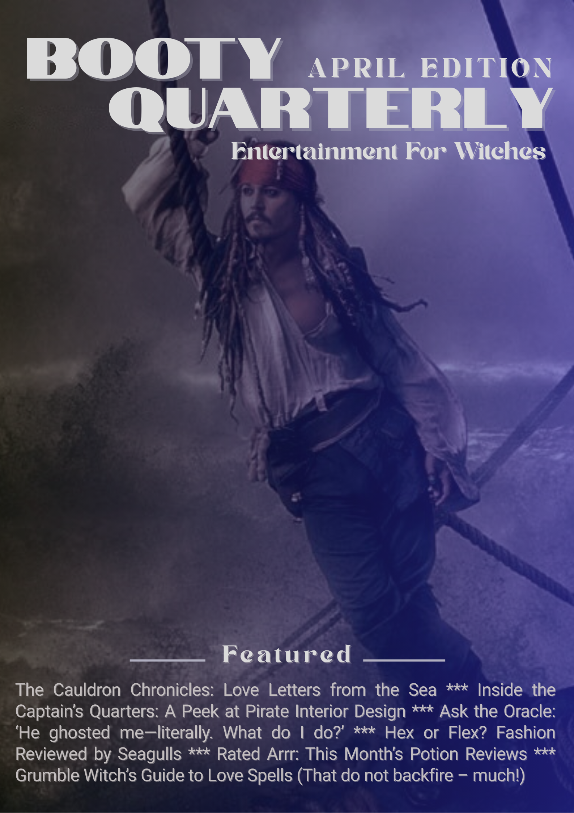

# 🏴‍☠️ Posters

This folder contains all the official posters and visual assets created for the **Code Pirates – Tech Treasure Hunt**.  
Each poster matches the pirate adventure theme and was used across different stages of the event to create excitement and engagement.

---

## 📜 Posters Overview

| Poster | Description |
|:------|:------------|
|  | **Teaser Poster** – Hinted at the upcoming treasure hunt and the mysteries involved. |
|  | **Main Event Announcement** – Introduced the pirate theme and opened registrations. |
|  | **With Hunt Poster** – Announced bounty rewards that players could earn and use later during the event. |
|  | **Playboy-magazine style JackSparrow poster** – A playful, magazine-style poster set up as part of the Witch’s Lair backdrop. |
|  | **Booty Quarterly** – A custom-designed pirate magazine cover, used as a prop for the Witch’s table environment. |

---

## 🎨 Credits

- **Design and Graphics:** Self, with creative insights and help from ChatGPT
- **Tools Used:** Canva / Photoroom/ Adobe

---

## 📢 Note

All posters are showcased here for documentation and educational purposes.  
Feel free to reuse based on your required adaptation

